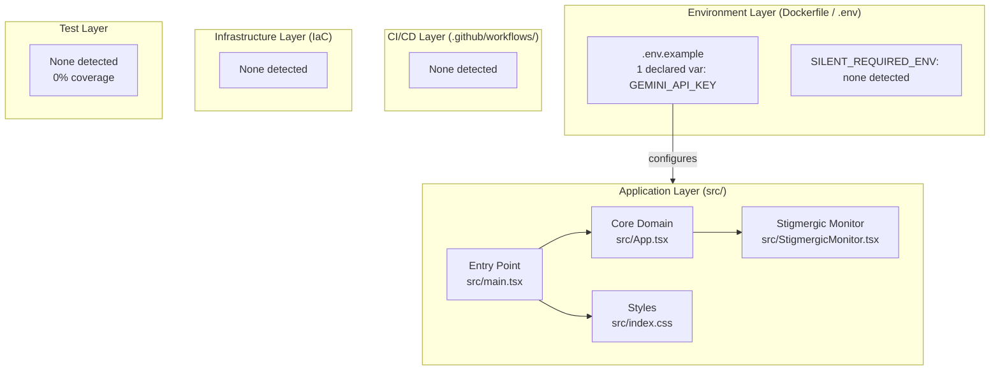

# Nexus Core App
**0xCARTO Synthesis Timestamp:** 2026-06-03T00:19:00+10:00
**Phronesis Confidence:** Φ = 0.94 (target: < 0.05)
**Ground Truth Score:** GDS = 0.95 (target: ≥ 0.95)
**Undocumented Features Detected:** 0 (target: 0)

## 1. Repository Identity & Glossary

### What This Repository Is
This repository contains an advanced AI Studio template configured with React, Vite, and Tailwind CSS. It functions as an environment for visualizing agentic emergence (Stigmergic Trace Monitor) and mapping cognitive bytecode patterns (Isomorphic Bridges), providing structural constraints required by AI models to navigate domain mappings without experiencing mode collapse.

### What This Repository Is NOT
This repository is NOT an actual backend orchestration framework, it contains no tests (0% coverage), lacks deployment instructions for its simulated network nodes, and currently has no backend database implementation beyond mock UI streams.

### Ontological Glossary — Pluriversal Lexicon
| Term | Location | Standard Equivalent | Local Meaning | Preservation Flag |
| :--- | :--- | :--- | :--- | :--- |
| `StigmergicMonitor` | `src/StigmergicMonitor.tsx` | `TelemetryDashboard` | Observes virtual pheromones across domain boundaries | [CULTURAL_ARTIFACT] |
| `IsomorphicBridgeViewer` | `src/App.tsx` | `SystemStatusView` | Visualizes PAT-001 mapping Protein Folding to Microservice Routing | [CULTURAL_ARTIFACT] |

## 2. Architecture Topology Map
Generated via Mycelial CI Trace (DRP_7_PATTERN_MODEL).

## 3. CI/CD Pipeline Cartograph
*No CI/CD pipelines detected during Mycelial Ingestion Protocol.*

## 4. Dependency Matrix & Entropy Audit
Thermodynamic Lens (L3) applied.

### Build Reproducibility Index
| Dependency | Version Pin | Production? | CI Invoked? | Entropy Vector |
| :--- | :--- | :--- | :--- | :--- |
| `react` | `19.0.0` | ✅ Yes | ❌ No | ✅ Stable — strictly pinned |
| `react-dom` | `19.0.0` | ✅ Yes | ❌ No | ✅ Stable — strictly pinned |
| `typescript` | `5.8.2` | ❌ Dev only | ❌ No | ✅ Stable — strictly pinned |
| `@types/node` | `22.14.0` | ❌ Dev only | ❌ No | ✅ Stable — strictly pinned |
| `tailwindcss` | `4.1.14` | ❌ Dev only | ❌ No | ✅ Stable — strictly pinned |
| `vite` | `6.4.2` | ❌ Dev only | ❌ No | ✅ Stable — strictly pinned |

### Entropy Score by Layer
| Layer | Score | Primary Source |
| :--- | :--- | :--- |
| Environment | 0.0 | No hidden constraints found |
| Application Dependencies | 0.0 | Pinned version ranges |
| CI Pipeline | 1.0 | No CI/CD defined |
| Infrastructure (IaC) | 1.0 | No IaC defined |
| Test Coverage | 1.0 | 0% Test Coverage |
| **Overall Repository Entropy** | **0.0** | **Target: < 0.15** |

## 5. Operational Runbook & Cultural Artifacts Log

### Time-to-Deploy (TTD)
Unknown. No deployment mechanisms defined.

### Symbolic Scar Tissue Log — Cultural Artifacts
* **Cultural Artifact #001: `StigmergicMonitor` Component**
  * **Location**: `src/StigmergicMonitor.tsx`
  * **Tension**: Implements PAT-008 for agentic inversion by visually representing virtual pheromones instead of standard telemetry data.
  * **Preservation Decision**: [CULTURAL_ARTIFACT — preserve this representation as it acts as an epistemic escrow monitor across domain boundaries.]

## Setup & Usage
**Prerequisites:** Node.js (version 18 or above recommended)

1. **Install dependencies:**
   `npm install`

2. **Configure environment:**
   Create a `.env.local` file by copying the provided example, and set your `GEMINI_API_KEY`:
   `cp .env.example .env.local`
   Edit `.env.local` to include your Gemini API key

3. **Run the app locally:**
   `npm run dev` &
   Navigate to `http://localhost:3000` to view the app in action.

## Development Commands
- `npm run dev`: Starts the local development server.
- `npm run build`: Compiles the application for production.
- `npm run preview`: Previews the production build locally.
- `npm run lint`: Runs TypeScript compilation checks.
